# Block Memory Generator (BMG) IP Specifications

CNN Accelerator 에서 사용하는 모든 Block Memory Generator IP 의 Vivado customization 설정.
IP 재생성 / 새 팀원 onboarding / 인터페이스 충돌 디버깅 시 참조.

각 IP 의 Verilog port signature 와 engine 측 결선까지 명시. 변경 시 본 문서 최신화 필수.

---

## 1. 전체 IP 목록 (한눈에)

| Component | Width A / B | Depth A / B | L | Byte Write | Primitive Output Reg | REGCEB Pin | 사용처 (write → read) |
|---|---|---|---|---|---|---|---|
| **`bram_c1_to_c2`** | 64 / 64 | 2048 / 2048 | 2 | ✓ (8-bit wea) | ✓ Enable | 미노출 (내부 tie 1) | Conv1 → Conv2 (ping-pong) |
| **`bram_c2_to_pool`** | 128 / 128 | 2048 / 2048 | 1 | ✗ (1-bit wea) | ✗ Disable | N/A | Conv2 → Maxpool (ping-pong) |
| **`conv2_weight_bram`** | 32 / 32 | 1024 / 1024 | 2 | ✗ (1-bit wea) | ✓ Enable | ✓ 노출 (engine 에서 상수 1 결선) | PS → Conv2 weight |
| **`bram_input`** | **32 / 8** (asymmetric) | **512 / 2048** | **1** | ✗ (1-bit wea) | **✗ Disable** | N/A (Output Reg 없음) | PS → Conv1 input image (ping-pong, 2 bank × 1024 byte). Port A = AXI burst 32-bit. Port B = Conv1 byte read. |
| **`conv1_weight_bram`** | 32 / 32 | 64 / 64 | 2 | ✗ (1-bit wea) | ✓ Enable | ✓ 노출 (engine 에서 상수 1 결선) | PS → Conv1 weight |
| (TBD) `bram_pool_to_fc` | TBD | TBD | TBD | TBD | TBD | TBD | Maxpool → FC |
| **`fc_weight_bram`** (사용 중, spec TBD) | TBD | TBD | TBD | TBD | TBD | TBD | PS → FC weight. RTL/fc/fc_engine.v:105 에서 instantiate. 본 문서 spec 은 작업 완료 후 확정. |

**공통 설정 (모든 BMG)**:
- Interface Type: **Native**
- Memory Type: **Simple Dual Port RAM** (SDP) — write/read 분리
- Common Clock: **✓ 체크** (단일 clock domain, clka=clkb=clk)
- ECC Type: No ECC
- Algorithm: Minimum Area

---

## 2. `bram_c1_to_c2` — Conv1 → Conv2 ping-pong buffer

### 2.1 용도

Conv1 의 8-channel output (8 IC × 26×26) 을 Conv2 의 c1c2 input BRAM 으로 전달.  
2 bank ping-pong: 한 image processing 중 다음 image 를 다른 bank 로 prefetch.

### 2.2 Vivado 설정

| Tab | 항목 | 값 |
|---|---|---|
| Basic | Memory Type | Simple Dual Port RAM |
| Basic | Common Clock | ✓ |
| Basic | Byte Write Enable | **✓** |
| Basic | Byte Size | 8 (bits) |
| Port A | Port A Width | **64** |
| Port A | Port A Depth | **2048** |
| Port A | Operating Mode | No Change (write only) |
| Port A | Enable Port Type | Use ENA Pin |
| Port B | Port B Width | 64 |
| Port B | Port B Depth | 2048 |
| Port B | Operating Mode | Write First |
| Port B | Enable Port Type | Use ENB Pin |
| Port B | Primitives Output Register | **✓ Enable** (L=2) |
| Port B | REGCEB Pin | 미체크 (Vivado 가 내부적으로 1 로 tie) |

### 2.3 Port signature

```verilog
bram_c1_to_c2 inst (
    .clka  (clk),
    .ena   (8-bit byte enable로 인한 write enable),
    .wea   (8-bit wea[7:0]),       // 각 byte = 각 IC channel
    .addra (11-bit addr),           // {bank, h[4:0], w[4:0]}
    .dina  (64-bit, 8 IC packed),

    .clkb  (clk),
    .enb   (1-bit ENA — Conv2 의 shift_en),
    .addrb (11-bit addr),
    .doutb (64-bit, 8 IC packed)
);
```

### 2.4 왜 이런 설정인가

- **Width 64 / Depth 2048**: 1 bank = 32×32 padded = 1024 entry × 2 bank = 2048. (실제 valid 영역은 26×26=676 / bank, 나머지 padding.) Width 64-bit = 8 IC × 8b 동시 read.
- **Byte Write Enable**: Conv1 의 8 channel 이 각각 다른 byte 위치에 write. wea[i] = i 번째 IC 의 write enable.
- **L=2 (Primitive Output Reg ON)**: conv2_engine 의 PIPELINE_FILL / HOLD / ADV timing 이 L=2 가정. 자세한 cycle-by-cycle 분석은 `RTL/conv2/conv2_timing.md` 참조.

### 2.5 참고 스크린샷

| Tab | Screenshot |
|---|---|
| Basic | 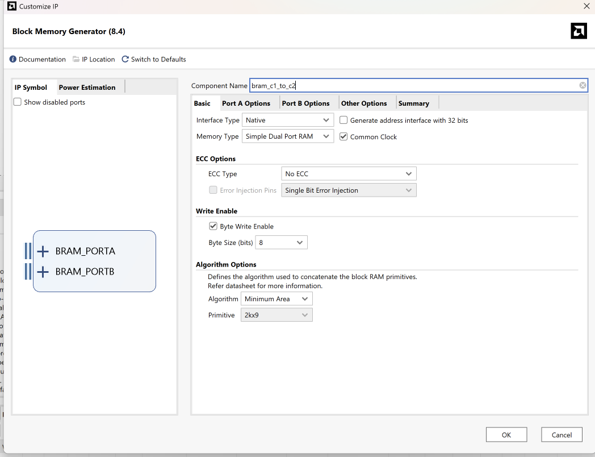 |
| Port A | 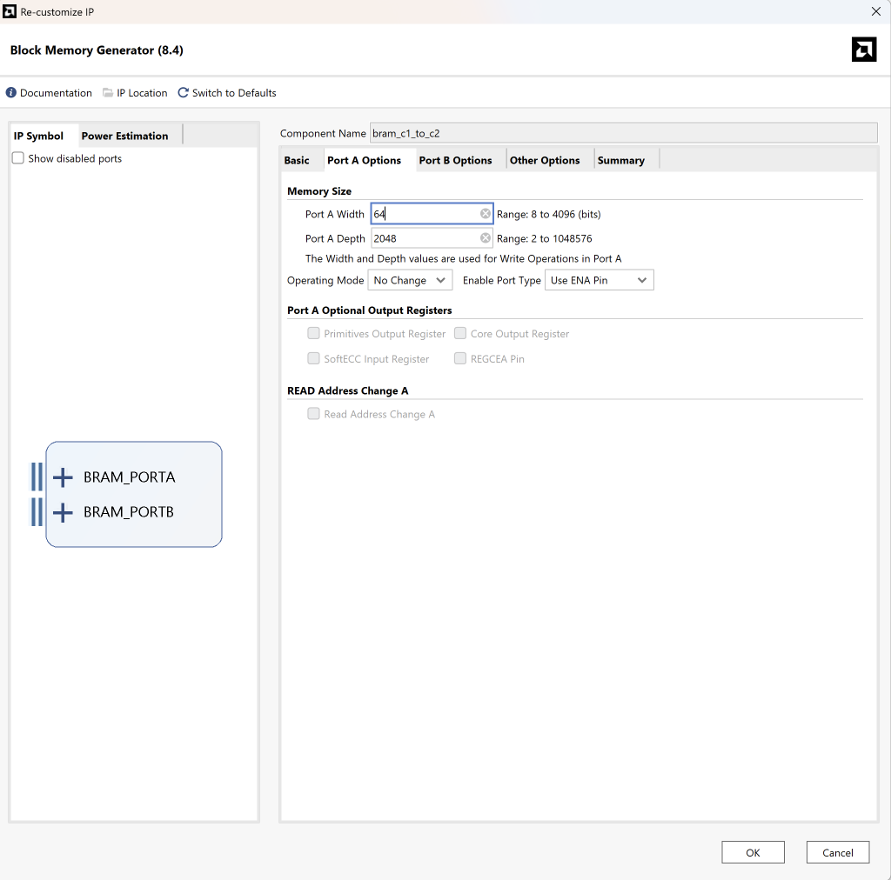 |
| Port B | 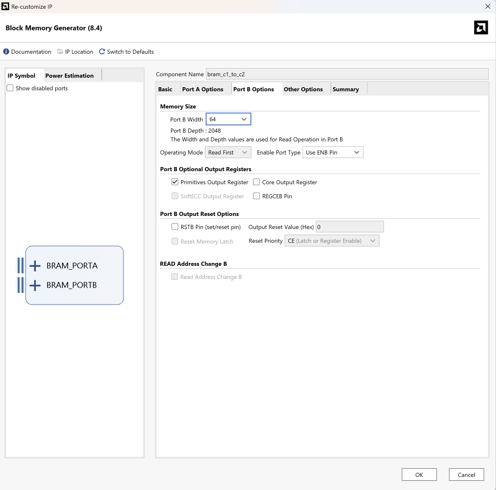 |
| Summary | 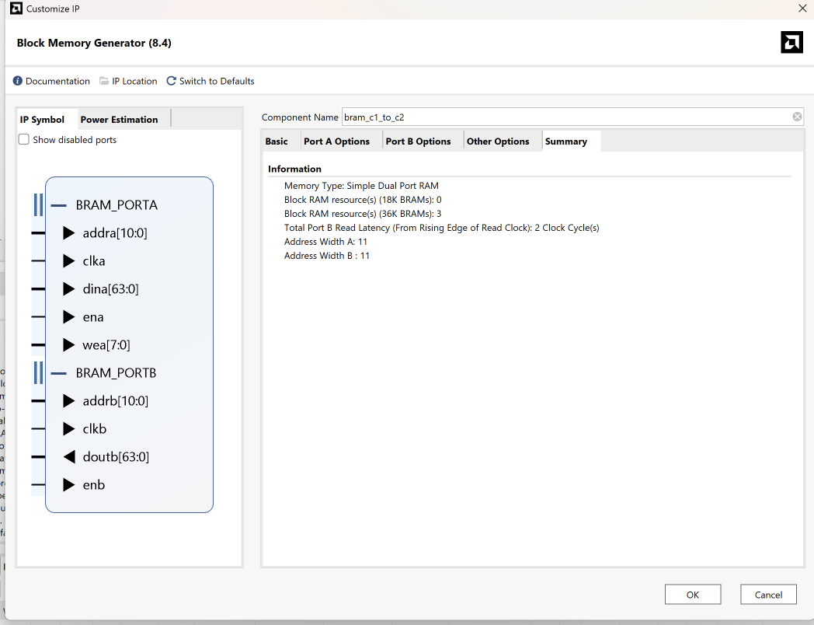 |

ping-pong buffer 의 design 초안: `bram_c1_to_c2/ping_pong_design_draft.jpeg`.

---

## 3. `bram_c2_to_pool` — Conv2 → Maxpool ping-pong buffer

### 3.1 용도

Conv2 의 16 OC × 24×24 output 을 Maxpool 의 input BRAM 으로 전달. 2 bank ping-pong.

### 3.2 Vivado 설정

| Tab | 항목 | 값 |
|---|---|---|
| Basic | Memory Type | Simple Dual Port RAM |
| Basic | Common Clock | ✓ |
| Basic | Byte Write Enable | **✗ 미체크** |
| Port A | Port A Width | **128** |
| Port A | Port A Depth | **2048** |
| Port A | Operating Mode | No Change |
| Port A | Enable Port Type | Use ENA Pin |
| Port B | Port B Width | 128 |
| Port B | Port B Depth | 2048 |
| Port B | Operating Mode | Write First |
| Port B | Enable Port Type | Use ENB Pin |
| Port B | Primitives Output Register | **✗ 미체크** (L=1) |
| Port B | REGCEB Pin | N/A (Output Reg 없음) |

### 3.3 Port signature

```verilog
bram_c2_to_pool inst (
    .clka  (clk),
    .ena   (Conv2 의 c2pool_we_a),
    .wea   (1'b1),                  // 1-bit, 항상 write all 128 bits
    .addra (11-bit addr),           // {bank, write_addr[9:0]}
    .dina  (128-bit, 16 OC packed),

    .clkb  (clk),
    .enb   (Maxpool 의 read enable),
    .addrb (11-bit addr),
    .doutb (128-bit, 16 OC packed)
);
```

### 3.4 왜 L=1 (Primitive Output Register Disable)?

`RTL/maxpool/maxpool_fsm.v` 의 phase counting 이 **L=1 가정**.
- maxpool 이 cycle T 에 addr 발행 → cycle T+1 에 doutb 받음.
- L=2 (Primitive Output Reg ON) 으로 두면 dout 이 1 cycle 더 늦게 와서 phase counter 와 misalign → mismatch.

자세한 분석은 `RTL/maxpool/` (검증 시) 또는 본 프로젝트의 이전 대화 기록 참조.

---

## 4. `conv2_weight_bram` — PS → Conv2 weight

### 4.1 용도

Pre-packed Conv2 SIMD weight (576 entry × 32-bit) 를 PS 측에서 AXI BRAM Controller 로 write,
Conv2 의 weight_loader 가 read 하여 192 PE 에 분배 (시스템 시작 시 1회).

### 4.2 Vivado 설정

| Tab | 항목 | 값 |
|---|---|---|
| Basic | Memory Type | Simple Dual Port RAM |
| Basic | Common Clock | **✓ 체크** |
| Basic | Byte Write Enable | **✗ 미체크** |
| Port A | Port A Width | **32** |
| Port A | Port A Depth | **1024** (576 만 사용, 1024 = power of 2 라 36K BRAM 1 개 efficient) |
| Port A | Operating Mode | No Change |
| Port A | Enable Port Type | Use ENA Pin |
| Port B | Port B Width | **32** (= Port A Width, A/B 비대칭 X) |
| Port B | Port B Depth | 1024 (자동) |
| Port B | Operating Mode | Write First |
| Port B | Enable Port Type | Use ENB Pin |
| Port B | Primitives Output Register | **✓ 체크** (L=2) |
| Port B | REGCEB Pin | **✓ 체크** (외부 결선 필요) |

### 4.3 Port signature

```verilog
conv2_weight_bram inst (
    .clka   (clk),
    .ena    (c2w_ena),             // ★ ENA — write 시 1 (ENA + WEA 둘 다 필요!)
    .wea    (c2w_ena),             // 1-bit wea (Byte Write Disable)
    .addra  (10-bit),
    .dina   (32-bit),              // SIMD packed weight (A_port = W1*2^17 + W0)

    .clkb   (clk),
    .enb    (1-bit, weight_loader 가 read 중일 때만 1),
    .addrb  (10-bit),
    .doutb  (32-bit),
    .regceb (1-bit)                // ★ 외부 결선 — `1'b1` 상수 묶음
);
```

> ⚠️ **"Use ENA Pin" 옵션 → ENA, WEA 두 신호 모두 결선 필수**.
> 둘 중 하나만 결선 시 write 안 일어남. (BMG 의 Port A write 는 `ENA AND WEA = 1` 조건.)
> 기존 behavioral 모델은 ENA 만 있었으나 (단순화), 실제 IP 와 wiring 차이 주의.

### 4.4 참고 스크린샷

| Tab | Screenshot |
|---|---|
| Basic | 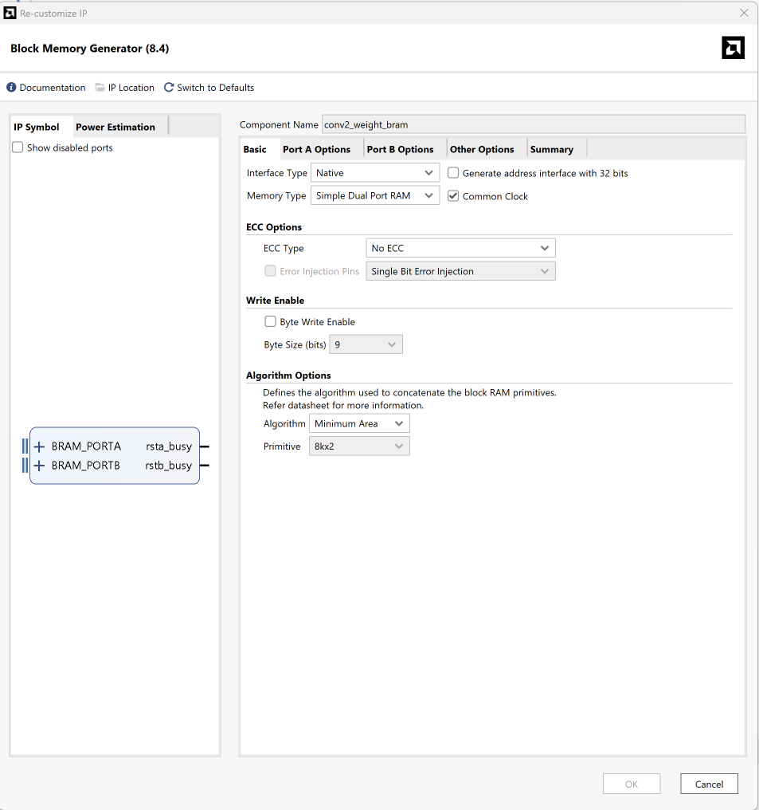 |
| Port A | 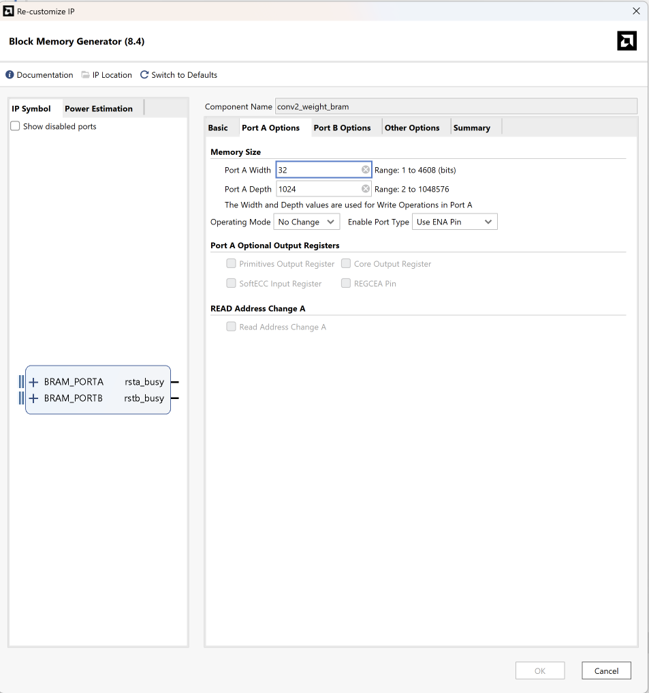 |
| Port B | 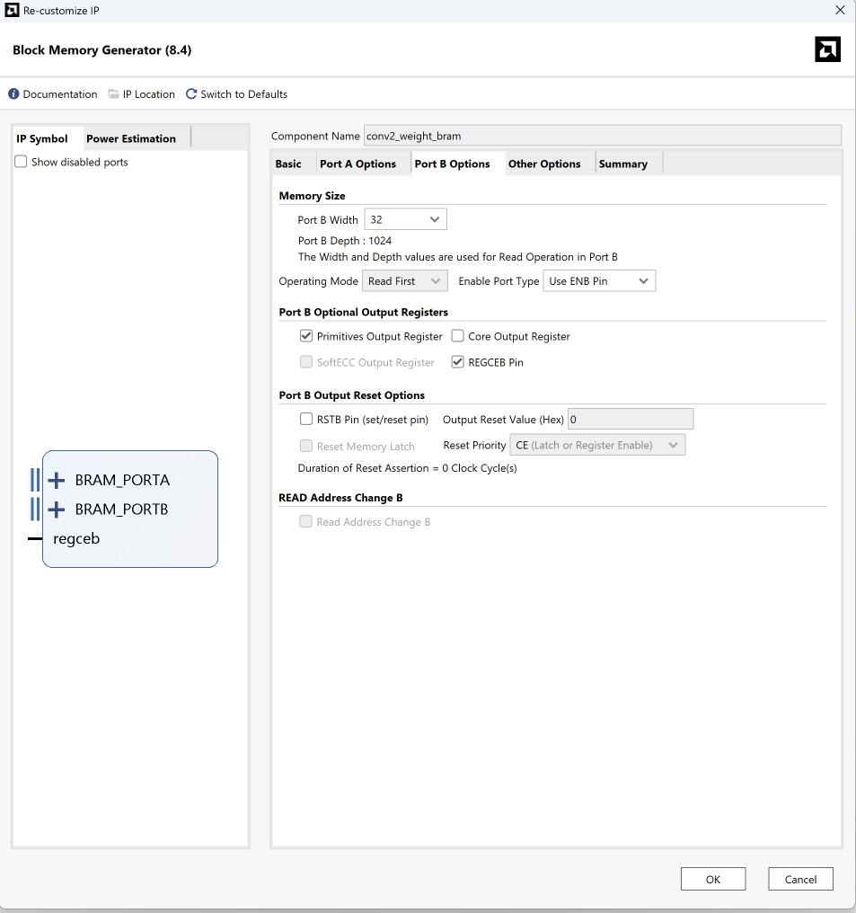 |
| Summary | 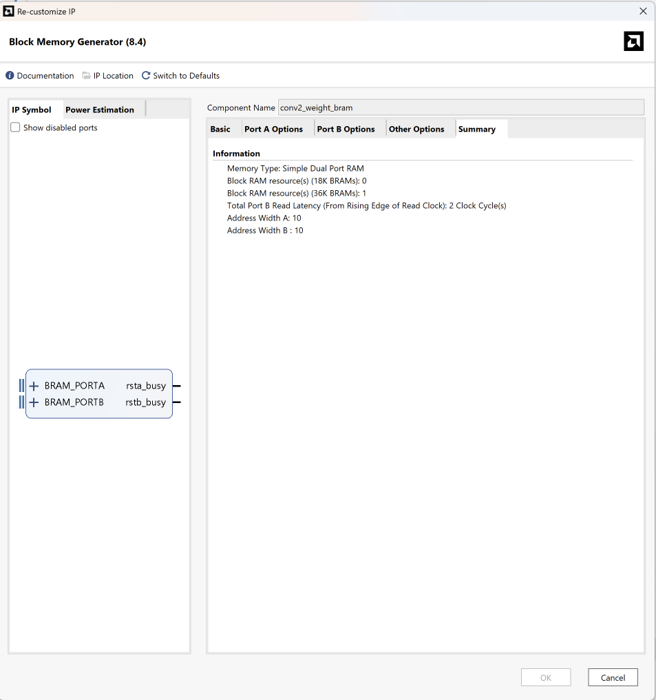 |

### 4.5 왜 REGCEB Pin 노출 + 상수 1 결선?

`weight_loader_conv2.v` 가 575 cycle 동안 sequential read 후 ENA=0 으로 OFF.
**L=2 의 output register 가 마지막 weight (mem[575]) 를 dout 으로 내보내려면 ENA=0 이후에도
REGCEB=1 이 1 cycle 더 필요**. ENB 와 같이 묶이면 → 마지막 weight 누락 → PE 적재 실패.

→ REGCEB pin 노출하고 engine 에서 `.regceb(1'b1)` 상수 결선:

```verilog
// conv2_engine.v
conv2_weight_bram c2w_bmg_inst (
    .enb    (c2w_enb),
    .regceb (1'b1)        // ← 마지막 weight propagation 보장
);
```

상세 메커니즘은 §부록 A 참조.

---

## 5. `bram_input` — PS → Conv1 input image (ping-pong, asymmetric width)

### 5.1 용도

PS 가 MNIST input image (28×28, 1 channel, INT8) 를 AXI BRAM Controller 로 **32-bit burst write**,
Conv1 의 input streaming 이 **8-bit byte read**. Port A/B width 가 다른 **asymmetric BMG**.

**2 bank ping-pong**: PS 가 다음 image 를 미리 write 하는 동안 Conv1 은 현재 image 처리.

총 메모리 = 2 KB = 2 bank × 1024 byte. PS 측에서는 512 word × 32-bit, Conv1 측에서는 2048 byte × 8-bit.

### 5.2 Vivado 설정

| Tab | 항목 | 값 |
|---|---|---|
| Basic | Memory Type | Simple Dual Port RAM |
| Basic | Common Clock | ✓ |
| Basic | Byte Write Enable | ✗ 미체크 |
| Port A | Port A Width | **32** (AXI burst — 4 byte per cycle) |
| Port A | Port A Depth | **512** (= 2048 byte / 4 byte = 512 word) |
| Port A | Operating Mode | No Change |
| Port A | Enable Port Type | Use ENA Pin |
| Port B | Port B Width | **8** (Conv1 픽셀 단위 read) |
| Port B | Port B Depth | 2048 (자동 — Vivado 가 A=32×512 와 같은 메모리 크기로 맞춤) |
| Port B | Operating Mode | Read First (강제도 OK) |
| Port B | Enable Port Type | Use ENB Pin |
| Port B | **Primitives Output Register** | **✗ 미체크 (L=1)** |
| Port B | Core Output Register | ✗ |
| Port B | REGCEB Pin | N/A (Output Reg 없음) |

> **왜 L=1?** `conv1_design.md §4` 와 `conv1_fsm` 의 6-cycle pipeline 가정이 BRAM L=1. broadcast fanout 도 작음 (8-bit single output → line_buffer 한 곳) → output register 불필요. L=2 로 두면 1 cycle 어긋남 → 출력 오염.

### 5.3 Port signature

```verilog
bram_input inst (
    .clka  (clk),
    .ena   (1-bit),
    .wea   (1-bit),
    .addra (9-bit),                 // word addr (0..511). MSB = bank.
    .dina  (32-bit),                // {byte3, byte2, byte1, byte0} (little-endian)

    .clkb  (clk),
    .enb   (in_bram_en = pipe_en),
    .addrb (11-bit = {input_bank_sel, in_addr[9:0]}),   // byte addr (0..2047)
    .doutb (in_bram_dout = signed [7:0])                // 1 byte per cycle
);
```

### 5.4 Byte 순서 (asymmetric BMG)

Vivado BMG 의 asymmetric width 는 **little-endian byte order** (default):
- Port A 의 word k 가 byte 4k, 4k+1, 4k+2, 4k+3 을 한꺼번에 담음.
- Port A dina = `{byte3, byte2, byte1, byte0}` 형태로 PS / TB 가 packing.
- Port B addr 4k+0 read → byte0 (= dina[7:0]).
- Port B addr 4k+1 read → byte1 (= dina[15:8]).
- 이런 식.

### 5.5 PS / TB Port A write pattern (single image, bank 0)

```verilog
// 784 byte image → 196 word
for (k = 0; k < 196; k = k + 1) begin
    in_addra = {1'b0, k[7:0]};        // bank 0 = MSB 0, word addr 0..195
    in_dina  = {input_mem[k*4 + 3],
                input_mem[k*4 + 2],
                input_mem[k*4 + 1],
                input_mem[k*4 + 0]};   // little-endian pack
end
```

> 784 = 4 × 196 정확히 나누어떨어짐 (운 좋게도). Padding 불필요.

### 5.6 참고 스크린샷

| Tab | Screenshot |
|---|---|
| Basic | 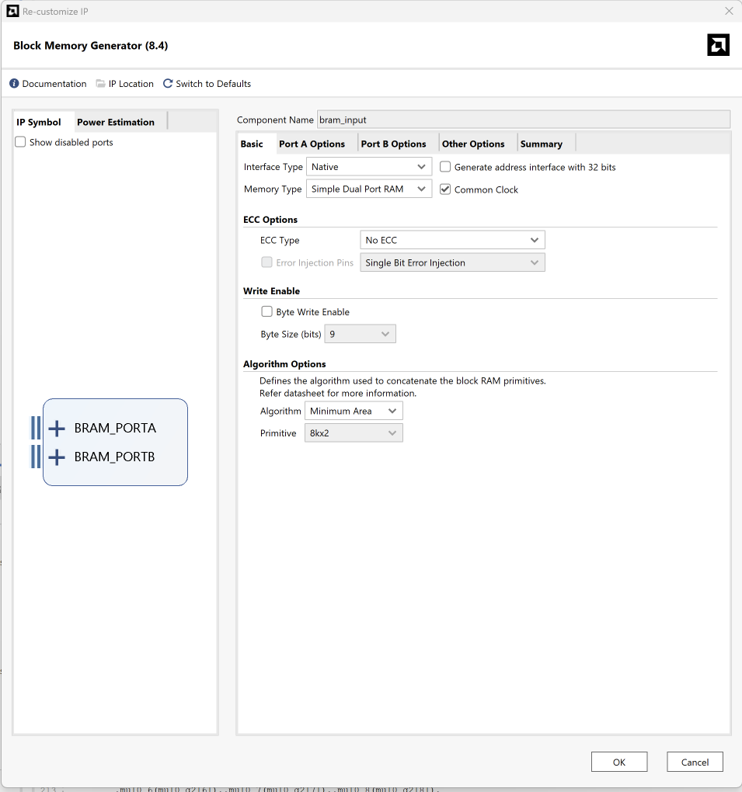 |
| Port A | 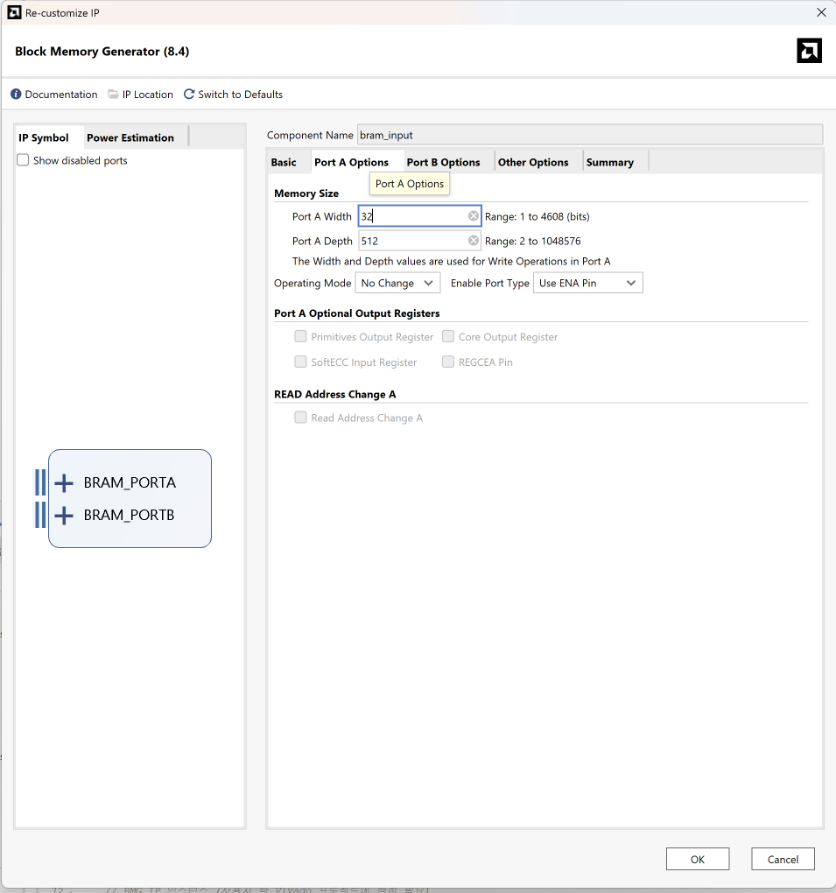 |
| Port B | 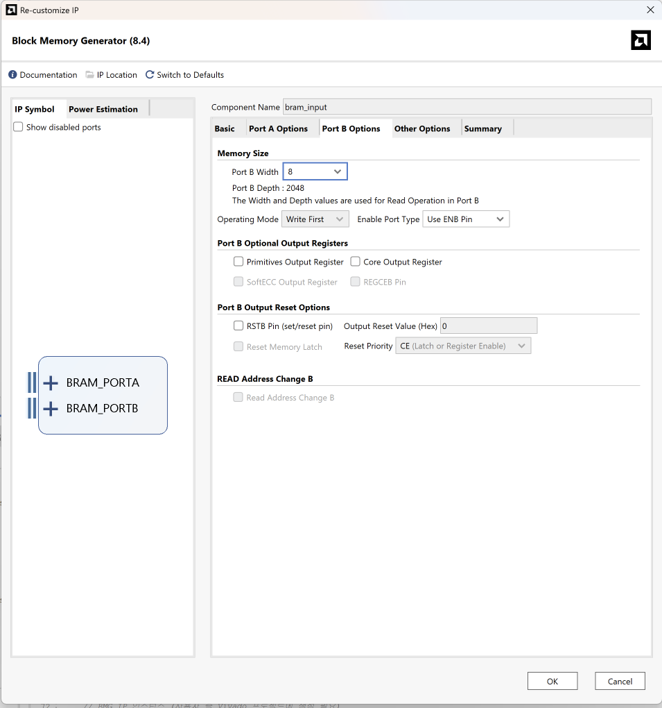 |
| Summary | 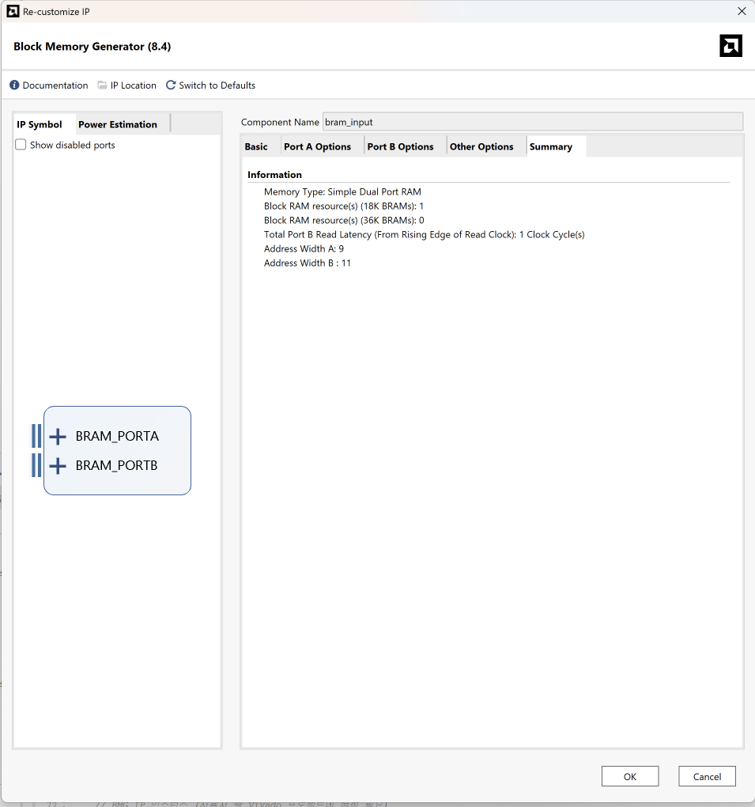 |

---

## 6. `conv1_weight_bram` — PS → Conv1 weight

### 6.1 용도

Pre-packed Conv1 SIMD weight (36 entry × 32-bit) 를 PS 가 write,
weight_loader 가 read 하여 18 PE 적재 (시스템 시작 시 1회).

### 6.2 Vivado 설정

| Tab | 항목 | 값 |
|---|---|---|
| Basic | Memory Type | Simple Dual Port RAM |
| Basic | Common Clock | ✓ |
| Basic | Byte Write Enable | ✗ 미체크 |
| Port A | Port A Width | **32** |
| Port A | Port A Depth | **64** (≥36; 64 = power of 2) |
| Port A | Operating Mode | No Change |
| Port A | Enable Port Type | Use ENA Pin |
| Port B | Port B Width | 32 |
| Port B | Port B Depth | 64 |
| Port B | Operating Mode | Write First |
| Port B | Enable Port Type | Use ENB Pin |
| Port B | Primitives Output Register | ✓ 체크 (L=2) |
| Port B | REGCEB Pin | **✓ 체크** (외부에서 1 결선 필요 — conv2_weight 와 동일 사유) |

### 6.3 Port signature

```verilog
conv1_weight_bram inst (
    .clka  (clk),
    .ena   (w_ena),                 // ENA + WEA 둘 다 결선 필수 (Conv2 weight 와 동일)
    .wea   (w_wea),
    .addra (6-bit),
    .dina  (32-bit),                // SIMD packed weight (W1*2^17 + W0)

    .clkb  (clk),
    .enb   (w_bram_en),
    .addrb (w_bram_addr = 6-bit),
    .doutb (w_bram_dout = 32-bit),
    .regceb(1'b1)                   // 마지막 weight propagation 보장
);
```

> ⚠️ Conv2 weight 와 동일 — ENA + WEA 둘 다 결선 + REGCEB 노출 + 상수 1.

### 6.4 참고 스크린샷

| Tab | Screenshot |
|---|---|
| Basic | 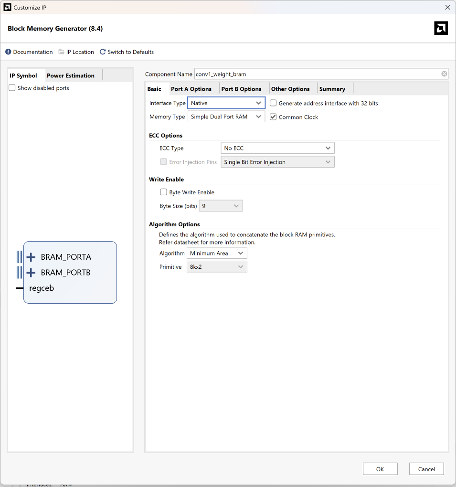 |
| Port A | ⚠️ 캡처 누락 — 추가 필요 (`conv1_weight_bram/conv1_weight_bram-portA.png`) |
| Port B | 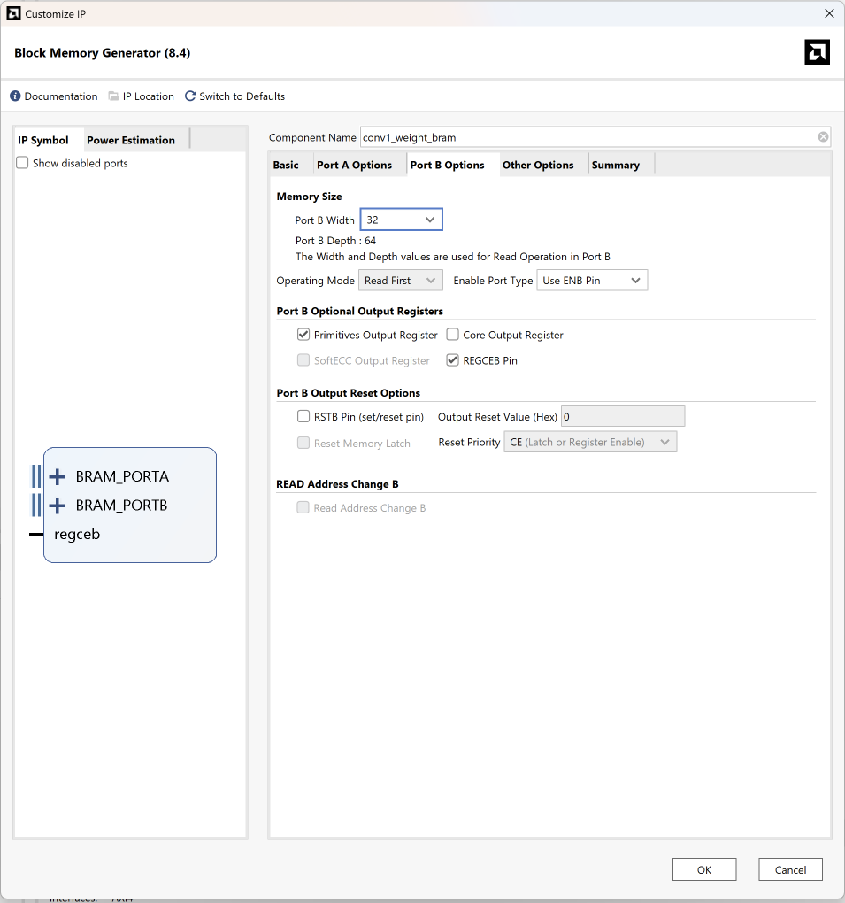 |
| Summary | 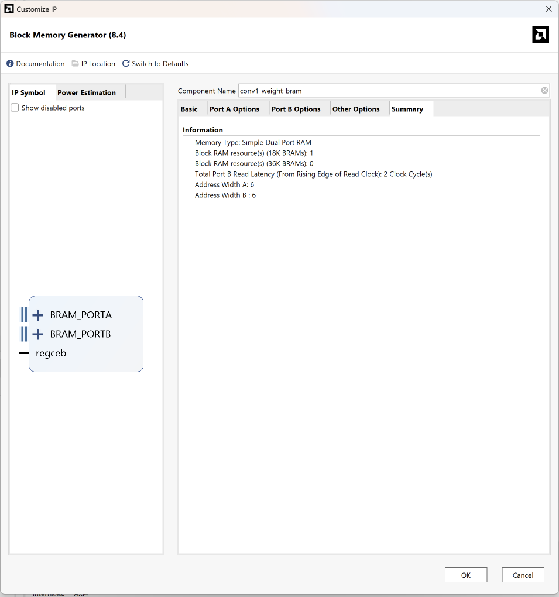 |

---

## 7. (TBD) Maxpool 측

`bram_pool_to_fc` 등. Maxpool layer 작업 완료 후 추가.

### 7.1 `fc_weight_bram` 현황

RTL/fc/fc_engine.v:105 에서 `fc_weight_bram` 인스턴스 사용. behavioral 모델 (RTL/fc/tb_fc_engine.v:287) 도 256-bit × 720 으로 정의되어 있으나 실제 Vivado BMG IP customization spec 은 본 문서에 미반영. FC layer 검증 시 본 §7 에 정식 spec 추가 예정.

---

## 8. (TBD) 공통 도구

### 8.1 Hex → COE 변환

Vivado IP customization 의 "Other Options" tab 에서 "Load Init File" 로 BMG 초기 메모리 init 가능. `.coe` format 필요. 변환 script (예: `scripts/weights/hex_to_coe.py`) — 현재 TBD.

대안: testbench 에서 Port A driving 으로 weight init (현재 `tb_conv2_engine.v` 의 `init_weight()` 방식).

---

## 부록 A: REGCEB pin 결선 원칙

### A.1 REGCEB 가 뭔지

BMG Port B 의 Primitive Output Register (L=2 stage) 의 **clock enable**:

```
mem[addrb]  ─→  core register  ─→  output register  ─→  doutb
                  ↑                    ↑
                gated by ENB        gated by REGCEB
```

- REGCEB=1: edge 마다 `output_reg ← core` (core 를 follow)
- REGCEB=0: output_reg HOLD (= doutb 값 고정)

### A.2 REGCEB pin 노출 vs 미노출

| 시나리오 | REGCEB pin | 결선 |
|---|---|---|
| **연속 read 중간에 ENA=0 cycle 없음** | 미노출 | Vivado 가 내부적으로 1 로 tie. 마지막 데이터는 다음 read 의 ENA=1 cycle 에 자연스럽게 propagate. (예: `bram_c1_to_c2` — Conv2 의 shift_en 이 PIPELINE_FILL/HOLD/ADV 동안 계속 toggle, 마지막 read 후 충분히 다른 read 시작) |
| **마지막 read 후 즉시 ENA=0 으로 깔끔하게 OFF** | **노출 필수** | 외부에서 1 상수 결선. 마지막 데이터의 core → output reg propagation 보장 위해. (예: `conv2_weight_bram` — weight_loader 가 575 cycle 후 깔끔하게 ENA OFF) |

### A.3 결선 예제

```verilog
// 미노출 케이스 (bram_c1_to_c2)
bram_c1_to_c2 c1c2_bram (
    .enb   (shift_en),              // ENA 만 결선
    .addrb (addr),
    .doutb (dout)
    // .regceb (...) ← port 자체가 없음
);

// 노출 케이스 (conv2_weight_bram)
conv2_weight_bram c2w_bmg (
    .enb    (c2w_enb),
    .addrb  (c2w_addrb),
    .doutb  (c2w_doutb),
    .regceb (1'b1)                  // ← 상수 1 결선
);
```

---

## 부록 B: L=1 vs L=2 선택 가이드

### B.1 L (read latency) 의 정의

- **L=1**: addr@T → doutb@T+1 (core register 만)
- **L=2**: addr@T → doutb@T+2 (core + output register)

### B.2 선택 기준

- **사용 모듈의 FSM 이 어떤 L 가정으로 작성되었는가** 가 유일한 결정 요인.
- L=1 ↔ L=2 변경 시 FSM 의 cycle 가정 (1 cycle shift) 깨짐 → mismatch.

### B.3 현재 프로젝트의 선택

| BMG | L | 이유 |
|---|---|---|
| `bram_c1_to_c2` | 2 | Conv2 fanout uniformity (모든 IC × line_buffer 까지 timing balance). `conv2_timing.md` 참조. |
| `bram_c2_to_pool` | 1 | maxpool_fsm 의 phase counting 이 L=1 가정 (간단한 1-cycle pipeline). |
| `conv2_weight_bram` | 2 | weight_loader 의 `latch_valid_dd` (2-cycle 지연) 가 L=2 가정. |

### B.4 L=2 채택 시 추가 고려

- REGCEB pin 노출 여부 (§부록 A 참조)
- output reg 가 추가 1 cycle latency 도입 → FSM 전이 조건 1 cycle 늦춰서 매핑 필요

---

## 부록 C: 본 문서 유지 관리

- IP 설정 변경 시 반드시 본 문서 update
- 새 BMG IP 추가 시 §1 표 + 새 섹션 추가
- Vivado IP customization screenshot 은 `docs/ip_spec/<ip_name>/` 에 저장. 디렉토리 이름은 **IP 코드 이름과 일치** (예: `bram_c1_to_c2/`, `conv1_weight_bram/`, `conv2_weight_bram/`, `bram_input/`). 파일명 규칙: `<ip_name>-<tab>.png`, tab ∈ {basic, portA, portB, summary}.
- 관련 RTL 파일 (`*_engine.v`, `*_loader.v`) 의 결선과 본 문서가 1:1 match 되는지 주기적 검증

### 관련 문서
- `docs/cowork_guide.md` — 프로젝트 전체 onboarding
- `RTL/conv2/conv2_design.md` — Conv2 설계 + BMG L=2 결정 배경
- `RTL/conv2/conv2_timing.md` — cycle-by-cycle BRAM read pipeline
- `RTL/conv1/conv1_design.md` — Conv1 설계
