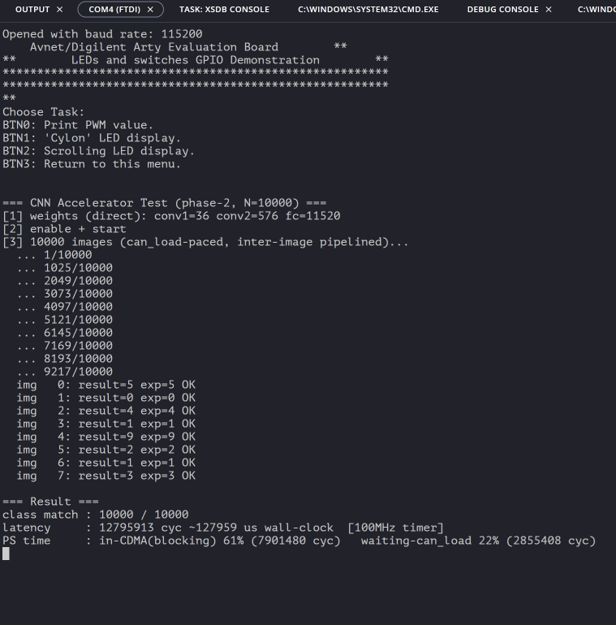
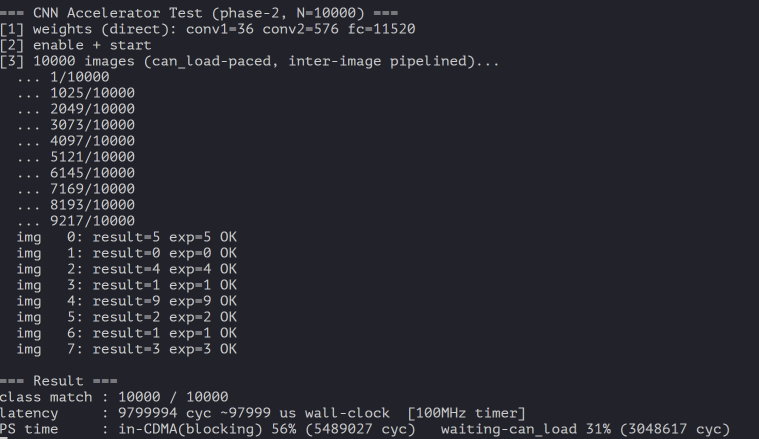

# Results Gallery

This page keeps the project result screenshots in milestone order.

## Naming Convention

Result screenshots use the following prefix:

`result_<stage>_<topic>_<condition>.png`

Pending slots are listed so that new hardware captures can be added without changing the ordering.

## Milestone Index

| Stage | Milestone | Screenshot | Evidence / Notes |
|---|---|---|---|
| 01 | Base direct CNN, 100MHz | Pending: `result_01_base_100MHz_hw.png` | Text evidence: `docs/overclock_journey_100_to_200mhz.md` records 100MHz baseline as 0.188s, 10000/10000. |
| 02 | DMA / CDMA input feed | `ip_spec/AXI_CDMA.png` | Architecture capture for AXI CDMA integration. Result capture slot: `result_02_dma_hw.png`. |
| 03 | Overclock 150MHz | `result_03_overclock_150MHz_hw.png` | Hardware result screenshot. |
| 04 | Overclock 200MHz + Vitis feed overlap | `result_04_overclock_200MHz_vitis_overlap_hw.png` | Current direct baseline result: about 98ms for 10000 images. |
| 05 | Complex Winograd F(4x4, 3x3), 200MHz | Pending: `result_05_winograd_200MHz_hw.png` | Add final board result screenshot after XSA/Vitis bring-up. RTL/timing references live in `docs/winograd/`. |

## 02. DMA / CDMA

## 03. Overclock 150MHz

## 04. Overclock 200MHz + Vitis Feed Overlap

## 05. Winograd 200MHz

Pending final screenshot:

`result_05_winograd_200MHz_hw.png`

